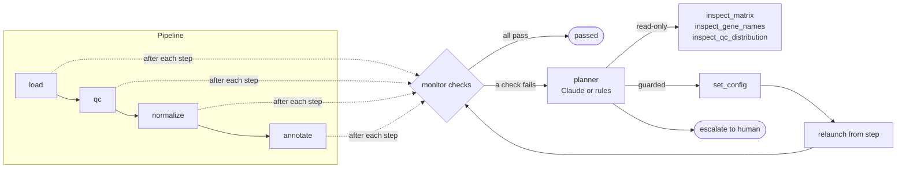

# selfheal-scpipe

A single-cell RNA-seq pipeline that watches itself. When a monitor check
fails, an LLM agent diagnoses the root cause with deterministic tools. It then
either applies a small allow-listed fix and relaunches, or escalates to a
human.

Everything runs on **public data** (10x PBMC3k). Faults are **injected on
purpose** so every failure is reproducible.

```
fail  ->  diagnose  ->  fix  ->  relaunch  ->  pass
                   \->  escalate (when no safe fix exists)
```

## Quick start

```bash
pip install -e ".[dev]"
python scripts/fetch_data.py                 # ~25 MB, writes data/pbmc3k_counts.h5ad
pytest -q                                    # offline, synthetic data, ~3 s

healpipe scenarios                           # list injected faults
healpipe run  --scenario species_mislabel    # one scenario, prints the trace
healpipe eval                                # all scenarios, prints a scorecard

export ANTHROPIC_API_KEY=...
healpipe eval --planner claude               # same scenarios, LLM planner
```

Traces go to `runs/traces/<scenario>.<planner>.trace.{md,json}`.

## Architecture



| Component | File | What it does |
|---|---|---|
| Pipeline | `pipeline.py` | Linear DAG with per-step caching, so a relaunch resumes from any step |
| Monitor | `monitor.py` | Checks symptoms after each step: value scale, orientation, mito genes found, cells retained, marker overlap, annotation confidence |
| Fault injector | `faults.py` | Turns clean counts into a broken run and records the expected outcome |
| Tools | `tools.py` | The agent's entire action space. All deterministic Python, with guardrails enforced in code |
| Planners | `agent.py` | `ClaudePlanner` (LLM tool-use loop) and `RulePlanner` (hand-written baseline) |
| Trace | `trace.py` | Symptom -> hypothesis -> action -> outcome, as JSON and markdown |

## Fault scenarios

| Scenario | What's broken | Symptom the monitor sees | Correct response |
|---|---|---|---|
| `prenormalized_input` | Upstream already ran normalize + log1p | `load.value_scale`: non-integer "counts" | inspect -> expm1 totals are constant -> `input_scale=log1p`, relaunch from `load` |
| `transposed_matrix` | Matrix saved genes x cells | `load.orientation`: obs names aren't barcodes | inspect -> var axis is barcodes -> `orientation=genes_x_cells` |
| `species_mislabel` | Human sample registered as mouse | `qc.mito_genes_detected`: 0 genes match `mt-` | inspect gene names -> uppercase, `MT-` -> `species=human`, relaunch from `qc` |
| `shallow_sequencing` | Library ~25x too shallow | `qc.cells_retained`: 0% pass | **escalate**. The tempting fix (lower `min_genes`) is blocked |
| `negative_values` | Broken ambient correction | `load.finite_nonnegative` | **escalate**. There's no safe automated fix |
| `clean` | nothing | all pass | agent is not invoked |

Scorecard with the rules planner on PBMC3k ([docs/eval_rules.md](docs/eval_rules.md)):

| scenario | expected | outcome | correct | relaunches | tool calls | label agreement |
|---|---|---|---|---|---|---|
| clean | clean | clean | yes | 0 | 0 | 79% |
| prenormalized_input | fixed | fixed | yes | 1 | 4 | 79% |
| transposed_matrix | fixed | fixed | yes | 1 | 4 | 79% |
| species_mislabel | fixed | fixed | yes | 1 | 4 | 79% |
| shallow_sequencing | escalated | escalated | yes | 0 | 3 | - |
| negative_values | escalated | escalated | yes | 0 | 3 | - |

The "label agreement" column compares the marker-based annotation with the
dataset's published labels. It confirms that a recovered run produces the
*same* biology as the clean run, not just a green checkmark. The monitor never
sees these labels.

Sample traces: [recovery](docs/sample_trace_prenormalized.md) · [escalation](docs/sample_trace_escalation.md).

## Design decisions

**The LLM plans, the tools act.** Claude chooses which evidence to gather and
which fix to try. Every tool is plain, testable Python. Claude never edits
data or writes code at runtime.

**Guardrails live in code, not in the prompt.** The prompt explains the
rules, and `Toolbox` enforces them:
- Only sample-sheet metadata (`species`, `input_scale`, `orientation`) is
  editable. QC thresholds are owned by humans. "Make QC pass by lowering the
  bar" is the classic bad automated fix, so it isn't in the action space.
- Relaunching with no config change is refused, which prevents blind retries.
- A relaunch must start at or before the earliest step the change affects, so
  stale cached outputs can't mask a fix.
- Relaunches are capped at 3, and an exhausted budget means escalation.
- Every tool call carries a required `rationale`, which becomes the hypothesis
  line in the trace.

**Checks report symptoms, not causes.** `0 genes matched 'mt-'` could be a
species mislabel or a gene-ID format problem. Separating the two is the
diagnosis, and that is where the LLM adds value over a lookup table.

**A rules baseline, on purpose.** `RulePlanner` encodes the same playbook
deterministically. Tests and CI run offline against it, and it gives a
baseline to measure the LLM against. The LLM is worth its cost when failures
fall outside the playbook: a new check fires, or two faults stack.

**Escalation is a success state.** Two of the six scenarios are graded
correct *only* if the agent escalates. An agent that "fixes" everything is
dangerous.

## Claude planner details

- `claude-opus-5-5` with adaptive thinking and an explicit `effort` (`--effort`, default `medium`).
- Manual tool-use loop, so the harness decides when to stop: after escalation, after a passing run, or after `max_turns`.
- `strict: true` tool schemas with enum-constrained arguments.
- Server-side refusal fallbacks are enabled. A `refusal` or `max_tokens` stop escalates.
- The message history is append-only. Assistant content is passed back unchanged.

## What I'd add for production

- Orchestrator integration (Dagster sensors or Prefect hooks) in place of the in-process runner.
- A persistent incident store, so the agent can retrieve how similar past failures were resolved.
- Human approval gates for actions above a risk tier, and dry-run diffs of config changes.
- A larger eval: stacked faults, novel checks, and repeated runs to measure LLM variance.
- Per-incident cost and latency tracking.

## Data

10x Genomics PBMC3k, taken from the example dataset in CZI's cellxgene
repository. `scripts/fetch_data.py` rebuilds exact integer UMI counts from the
normalized `.raw` matrix and asserts that per-cell totals match the published
`n_counts`. The marker panel uses textbook PBMC markers.
